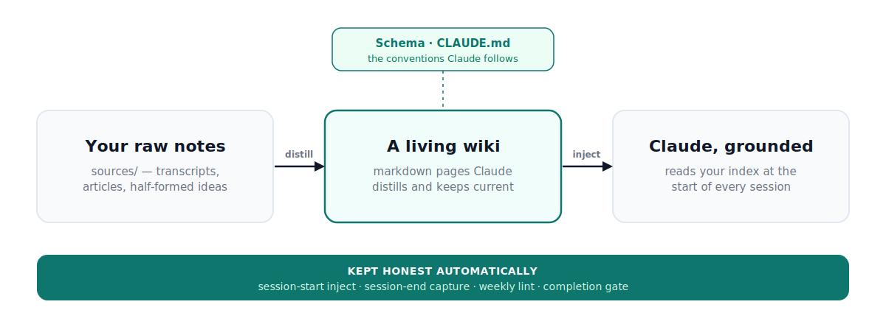

# Karpathy+

**Give Claude a memory that sticks.** Out of the box, Claude forgets everything the moment a chat ends. Karpathy+ turns a folder of plain text files into a knowledge base Claude reads at the start of every session and keeps current as you go.

**What you get:**
- a knowledge base Claude actually reads, every session, automatically
- that stays current as you work, instead of quietly rotting
- in plain markdown files you own outright. No database, no lock-in.

## Start here: hand this repo to Claude

The whole quickstart is one sentence. Open this folder in **Claude Code** and say:

> *Set this system up for me from this repo, following SETUP.md. Ask me anything you need before you start.*

Claude does the rest:
- creates the files
- wires up the hooks
- asks you the handful of things only you can answer

You barely need to read further. Everything below is for when you (or Claude) want to understand or change a piece.

> **One requirement:** Karpathy+ runs on [Claude Code](https://claude.com/claude-code), Anthropic's terminal app (it uses your paid API). It does **not** work with claude.ai in the browser. You'll also want `git` and the `gh` CLI.

## How it works

Three layers from Karpathy's [LLM-wiki pattern](https://gist.github.com/karpathy/442a6bf555914893e9891c11519de94f), plus an operations layer that keeps the whole thing honest.

**The three layers** (Karpathy's):
- **Sources:** your raw notes, transcripts, articles. Treated as immutable.
- **Wiki:** the markdown pages Claude distills from them. The part you actually use.
- **Schema:** a small `CLAUDE.md` that tells Claude the conventions.

**The operations layer** (mine, the part that keeps it from rotting):
- a **session-start hook** that injects your index into every conversation
- a **session-end hook** that records what changed
- a **weekly lint** that catches drift
- a **completion gate** and one **boundary rule**

It doesn't keep itself correct. It surfaces drift fast and makes reconciling it cheap, so *you* keep it in sync in minutes a week. **The enforcement is the product.**

> *Not affiliated with, sponsored by, or endorsed by Andrej Karpathy.*

## Ways in

- **Just use it:** open in Claude Code and say "set this up for me" (above).
- **Set it up by hand:** [SETUP.md](SETUP.md), about 15 minutes.
- **Build from scratch / understand every piece:** [BUILD-GUIDE.md](BUILD-GUIDE.md).
- **Publishing your own fork:** [PUBLISHING.md](PUBLISHING.md).

## What's in the box

**`wiki/`** is the knowledge layer. It becomes your `~/knowledge/wiki`: an index, an operating manual, and empty buckets to fill.

**`runtime/`** is what makes it run (these go into `~/.claude`):
- `CLAUDE.md` is the ~50-line rules file Claude reads every session
- `hooks/session-inject.sh` injects your index and nudges you when the lint is overdue
- `hooks/wiki-session-hook.py` records what changed each session
- `commands/wiki-lint.md` is the weekly health check (`/wiki-lint`)
- `settings.json.example` is the hook wiring

> Already on Claude Code? You already have a `~/.claude/CLAUDE.md` and `settings.json`. Back them up and **merge** the new pieces in. Don't blind-copy over them; SETUP.md shows how.

## The one rule that matters

Knowledge lives in one place (`~/knowledge`). Runtime lives somewhere else (`~/.claude`). **Never collapse them.** That separation is what stops the same fact living in three files and drifting apart. Everything else is detail.

## Two halves

- **Building it** is an afternoon.
- **Living with it** is a few minutes a week, forever. That second half is the whole point.

Ask it questions, test it, correct it, reconcile it when it disagrees with itself. Skip that and you have a notebook, not a system that stays true.

## How this differs

The closest prior art is heavier by design:
- `claude-mem` and the "second brain" repos lean on SQLite and embeddings
- `claude-memory-compiler` runs an Agent-SDK compile pipeline
- several ship as installable plugins you bolt on
- hosted context-graph products (like HipAI) manage it as a service

This is deliberately the opposite: **markdown-only, human-in-the-loop, a "Use this template" repo you own outright**, with nothing to install beyond the files. The primitives here aren't novel, and that's the honest concession. The value is the debugged default arrangement plus the maintenance discipline that keeps it from rotting.

---

Built by Ethan Ouimet ([eqctrl.io](https://eqctrl.io)). MIT licensed. Adapt freely, credit if you fork.

**I love meeting people building interesting things, and first chats are always free.** Want a hand wiring this around your actual work, or just want to talk shop? Come say hi at [eqctrl.io](https://eqctrl.io).
